# Framework 类图

> `operator-framework-spring-boot-starter`（Spring Boot 3.5 / JDK 21）类结构总览。
>
> 关系记号：`--|>` 继承（实线）、`..|>` 实现接口（虚线）、`-->` 关联/使用、`..>` 依赖/创建、`o--` 聚合。

## 总体类图

```mermaid
classDiagram
direction TB

%% ===== API 契约接口 =====
class Reconciler
class ControllerRuntime
class ControllerRuntimeFactory
class KubernetesEventPublisher
class LeaderElectionAdapter
class ResourceMapper
class AdmissionMutator
class AdmissionValidator
class ResourceConverter

%% ===== Controller 运行时实现 =====
class Fabric8Controller
class Fabric8ControllerRuntimeFactory
class RuntimeGroup
class ControllerRegistrationDiscovery
class PrimaryHandler
class SecondaryHandler
class OperatorFrameworkLifecycle
class FrameworkKubernetesClientOwnership

%% ===== Leader / Event / Actuator =====
class Fabric8LeaderElectionAdapter
class AggregatingKubernetesEventPublisher
class OperatorFrameworkHealthIndicator
class OperatorFrameworkMetrics
class RuntimeReadiness
class GaugeHandle

%% ===== Webhook =====
class WebhookCallbackRegistry
class AdmissionWebhookController
class ConversionWebhookController

%% ===== Policy (AOP) =====
class ReconcileObservationAspect
class ReconcileExceptionAspect
class ReconcileRetryAspect
class ReconcileRateLimitAspect
class ReconcileTerminalException
class MalformedReviewException
class ResourceTypeMismatchException
class ConversionFailedException

%% ===== API 值对象/构建器 =====
class ControllerBuilder
class ControllerRegistration

%% ===== 外部类型 (fabric8 / Spring / JDK) =====
class ResourceEventHandler
class SmartLifecycle
class HealthIndicator
class ApplicationListener
class AutoCloseable
class DisposableBean
class RuntimeException
class Exception

%% ---- 实现关系 ----
Fabric8Controller ..|> ControllerRuntime
Fabric8ControllerRuntimeFactory ..|> ControllerRuntimeFactory
RuntimeGroup ..|> ControllerRuntime
Fabric8LeaderElectionAdapter ..|> LeaderElectionAdapter
AggregatingKubernetesEventPublisher ..|> KubernetesEventPublisher
AggregatingKubernetesEventPublisher ..|> AutoCloseable
OperatorFrameworkLifecycle ..|> SmartLifecycle
OperatorFrameworkHealthIndicator ..|> HealthIndicator
RuntimeReadiness ..|> ApplicationListener
GaugeHandle ..|> AutoCloseable
FrameworkKubernetesClientOwnership ..|> DisposableBean
PrimaryHandler ..|> ResourceEventHandler
SecondaryHandler ..|> ResourceEventHandler

%% ---- 异常继承 ----
ReconcileTerminalException --|> RuntimeException
MalformedReviewException --|> RuntimeException
ResourceTypeMismatchException --|> RuntimeException
ConversionFailedException --|> Exception

%% ---- 关联/依赖 ----
OperatorFrameworkLifecycle --> ControllerRuntimeFactory : 创建 runtime
OperatorFrameworkLifecycle --> LeaderElectionAdapter : leader 选举
Fabric8ControllerRuntimeFactory ..> ControllerRuntime : create()
Fabric8ControllerRuntimeFactory --> ControllerRegistrationDiscovery : discover()
ControllerRegistrationDiscovery --> Reconciler : 扫描 bean
ControllerRegistrationDiscovery --> ControllerRegistration : 收集
AdmissionWebhookController --> WebhookCallbackRegistry
ConversionWebhookController --> WebhookCallbackRegistry
RuntimeGroup o-- ControllerRuntime : 聚合
```



> 注：`classDiagram` 的 `direction TB` 与 `o--`/`..>` 在部分旧版 Mermaid 渲染器上可能退化，但关系语义不受影响。

## 设计约定：泛型资源类型 `T extends HasMetadata`

framework 的资源 API 普遍用 **泛型约束** `T/S extends HasMetadata` 约束资源类型，**不是类继承**。扫描时易被误判为继承，实则都在泛型参数列表内：

| 类型 | 声明（节选） |
| --- | --- |
| `Reconciler` | `interface Reconciler<T extends HasMetadata>` |
| `ControllerRegistration` | `final class ControllerRegistration<T extends HasMetadata>` |
| `ControllerBuilder` | `final class ControllerBuilder<T extends HasMetadata>` |
| `Fabric8Controller` | `final class Fabric8Controller<T extends HasMetadata> implements ControllerRuntime` |
| `ReconciliationContext` | `record ReconciliationContext<T extends HasMetadata>(...)` |
| `ResourceEvent` | `record ResourceEvent<S extends HasMetadata>(...)` |
| `ResourceMapper` | `interface ResourceMapper<S extends HasMetadata, T extends HasMetadata>` |
| `SecondaryWatch` | `record SecondaryWatch<S extends HasMetadata, T extends HasMetadata>(...)` |
| `AdmissionMutator`/`AdmissionValidator`/`ResourceConverter` | `interface …<T extends HasMetadata>` |
| `SecondaryHandler` | `final class SecondaryHandler<S extends HasMetadata> implements ResourceEventHandler<S>` |
| `Callback` | `record Callback(..., Class<? extends HasMetadata> resourceType)` |

`HasMetadata`（fabric8 `io.fabric8.kubernetes.model.HasMetadata`）是 K8s 资源基接口；framework 在其上构建类型安全的泛型 API，因此**不画 `… → HasMetadata` 的继承箭头**。

## 核心抽象与实现

| 接口（`api.*` / `internal.*`） | 唯一实现 | 职责 |
| --- | --- | --- |
| `Reconciler<T>` | （用户实现，如 echo-operator 的 EchoReconciler） | 调谐单个资源类型的核心契约 |
| `ControllerRuntime` | `Fabric8Controller`、`RuntimeGroup` | 运行 informer + worker，产出 reconcile 事件 |
| `ControllerRuntimeFactory` | `Fabric8ControllerRuntimeFactory` | 按 `ControllerRegistration` 创建 `ControllerRuntime` |
| `LeaderElectionAdapter` | `Fabric8LeaderElectionAdapter` | 租约 leader 选举，获主后回调启动 runtime |
| `KubernetesEventPublisher` | `AggregatingKubernetesEventPublisher` | 聚合发布 K8s Event（`AutoCloseable`） |
| `ResourceMapper<S,T>` | （用户实现） | 在 primary/secondary 资源间转换 |
| `AdmissionMutator`/`AdmissionValidator` | （用户实现） | 准入 webhook 变更/校验 |
| `ResourceConverter<T>` | （用户实现） | webhook 版本转换 |

## 生命周期与 Spring 接入

| framework 类 | 实现（外部） | 作用阶段 |
| --- | --- | --- |
| `OperatorFrameworkLifecycle` | `SmartLifecycle`（Spring，`isAutoStartup=true`） | refresh 后 `start()` 驱动 leader 选举 → runtime |
| `OperatorFrameworkHealthIndicator` | `HealthIndicator`（Spring Boot actuator） | 暴露 runtime/leader 就绪健康 |
| `RuntimeReadiness` | `ApplicationListener`（Spring） | 监听就绪事件，驱动 readiness 状态机 |
| `FrameworkKubernetesClientOwnership` | `DisposableBean`（Spring） | 托管 `KubernetesClient` 关闭 |
| `GaugeHandle`、`AggregatingKubernetesEventPublisher` | `AutoCloseable`（JDK） | 指标句柄/事件发布器清理 |

## Policy (AOP) 切面顺序

四个 `@Aspect` 用 `@Order` 控制 reconcile 调用链的 advice 嵌套序（值大在外层先拦截）：

```
RateLimitAspect (HIGHEST_PRECEDENCE + 400)   ← 最外层
  → RetryAspect (+300)
    → ExceptionAspect (+200)
      → ObservationAspect (+100)            ← 最内层，紧贴业务
        → Reconciler.reconcile()
```

异常：`ReconcileTerminalException`（终态，不重试）→ `RuntimeException`；webhook 侧 `MalformedReviewException`/`ResourceTypeMismatchException`→`RuntimeException`，`ConversionFailedException`→`Exception`。

## 包职责

| 包 | 职责 | 主要类型 |
| --- | --- | --- |
| `api.reconcile` | 调谐核心契约与上下文 | `Reconciler`、`ReconciliationContext`、`ResourceKey`、`ResourceReference`、`ReconcileResult`、`StatusUpdates`、`Finalizers`、`ReconciliationTrigger`、`ResourceEventType`、`TriggerRole` |
| `api.controller` | 控制器注册与构建 | `ControllerBuilder`、`ControllerRegistration`、`ResourceMapper`、`Mappers`、`ResourceEvent` |
| `api.event` | 事件发布契约 | `KubernetesEventPublisher` |
| `api.webhook` | 准入/转换 webhook 契约 | `AdmissionMutator`、`AdmissionValidator`、`ResourceConverter`、`AdmissionContext`、`ConversionContext`、`AdmissionDecision`、`ConversionResult`、`MutationResult`、`UserIdentity`、`Status` |
| `internal.controller` | runtime 内核实现 | `Fabric8Controller`、`Fabric8ControllerRuntimeFactory`、`ControllerRuntime`、`ControllerRuntimeFactory`、`RuntimeGroup`、`OperatorFrameworkLifecycle`、`ControllerRegistrationDiscovery`、`PrimaryHandler`、`SecondaryHandler`、`SecondaryWatch`、`GenerationFilter`、`ReconciliationQueue`、`FrameworkKubernetesClientOwnership`、`RuntimeLifecycleSupport`、`DurationMillis`、`Work` |
| `internal.leader` | leader 选举 | `LeaderElectionAdapter`、`Fabric8LeaderElectionAdapter` |
| `internal.event` | 事件聚合实现 | `AggregatingKubernetesEventPublisher`、`CachedEvent`、`EventRequest` |
| `internal.webhook` | webhook 控制器实现 | `AdmissionWebhookController`、`ConversionWebhookController`、`WebhookCallbackRegistry`、`Callback`、`Invocation`、异常类 |
| `internal.policy` | AOP 切面 | `ReconcileObservationAspect`、`ReconcileExceptionAspect`、`ReconcileRetryAspect`、`ReconcileRateLimitAspect`、`ReconcileInvocationKey`、`SpringCallbackIdentifier`、`ReconcileTerminalException` |
| `internal.actuator` | 健康/指标 | `OperatorFrameworkHealthIndicator`、`OperatorFrameworkMetrics`、`RuntimeReadiness`、`GaugeHandle` |
| `autoconfigure` | Spring Boot 自动配置 | `OperatorFrameworkAutoConfiguration`、`OperatorFrameworkProperties`（嵌套 `Controller`/`LeaderElection`/`Retry`/`RateLimit`/`Events` + `Mode`） |
